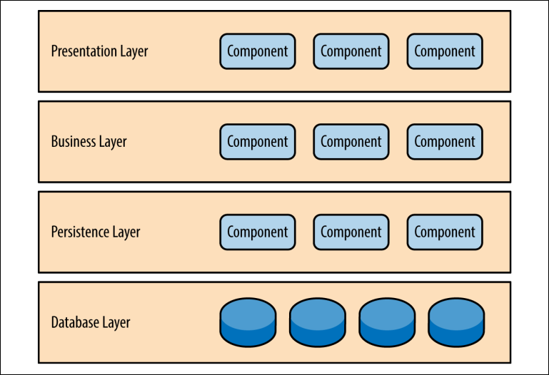
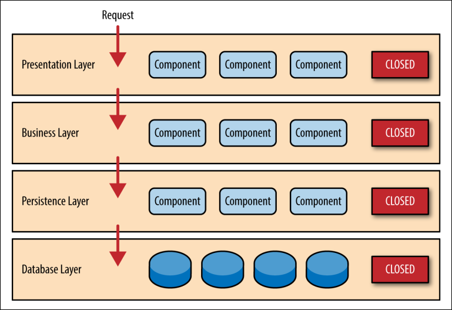
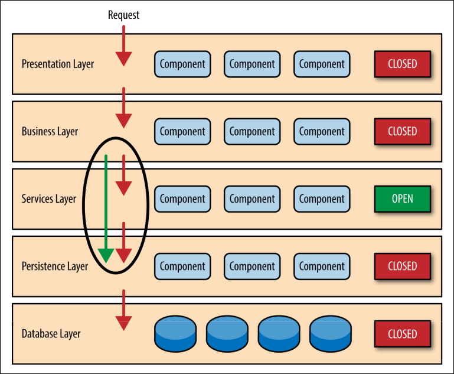
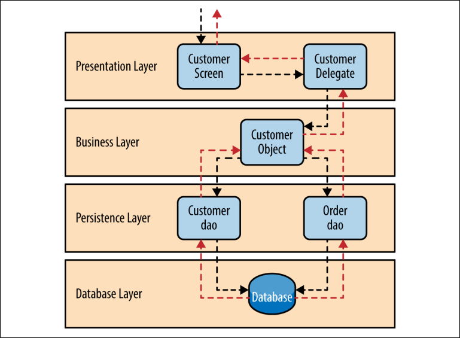

제 1장
# 계층화된 아키텍처
  가장 일반적인 아키텍처 패턴은 계층화된 아키텍처 패턴이며, 그 다음은 N-tier 아키텍처 패턴으로 알려져 있다. 이 패턴은 Java EE 애플리케이션 대부분에 대해 사실상 표준이므로 관련된 설계자, 디자이너 및 개발자들에 의해 널리 알려져 있다. 
  layered 아키텍처 패턴은 대부분의 기업에서 관행적인 IT 소통  및 조직 구조와 밀접하게 맞아떨어지므로 대부분의 비즈니스 애플리케이션 개발에 있어 선택되는 패턴이다.
 
 ## 패턴설명
 계층화된 아키텍처 패턴 내의 구성요소는 수평적으로 구성되며, 각 계층은 애플리케이션 내에서 특정 역할을 수행한다(예: 표현 로직 또는 비즈니스 논리). 계층화된 아키텍처 패턴은 패턴에 존재해야 하는 계층의 수와 유형을 명시하지 않지만, 대부분의 계층화된 아키텍처는 표현계층, 비지니스계층, 지속성계층, 데이터베이스계층 등 4개의 표준 계층으로 구성된다(그림 1-1). 경우에 따라 비즈니스 계층과 지속성 계층이 단일 비즈니스 계층으로 결합되며, 특히 지속성 논리(예: SQL 또는 HSQL)가 비즈니스 계층 구성 요소 내에 통합될 때 특히 그렇다.
 
 따라서 소규모 애플리케이션은 세 개의 계층만 가질 수 있는 반면, 더 크고 더 복잡한 비즈니스 애플리케이션은 다섯 개 이상의 계층을 포함할 수 있다. 계층화된 아키텍처 패턴의 각 계층은 애플리케이션 내에서 특정한 역할과 책임을 갖는다. 
 
 예를 들어, 표현계층은 모든 사용자 인터페이스와 브라우저 통신 논리를 처리하고, 비즈니스 계층은 요청과 관련된 특정 비즈니스 규칙을 수행하는 역할을한다. 아키텍처의 각 계층은 특정한 요청을 완료하기 위해 수행되어야 하는 작업을 중심으로 책임을 다한다. 
 
 예를 들어, 표현 계층은 고객 데이터를 얻는 방법에 대해 신경 쓸 필요가 없다. 특정 형식의 화면에만 해당 정보를 표시하면 된다. 마찬가지로, 비즈니스 계층은 화면에 표시할 고객 데이터를 포맷이나  고객 데이터의 출처에 대해 신경 쓸 필요가 없다. 즉, 지속성 계층에서 데이터를 가져오고 데이터에 대해 비즈니스 논리(예: 계산이나 집계)를 수행하며, 해당 정보를 사전 정보로 전달하면 된다.
 
  
  
 _그림 1-1. 계층화된 아키텍처 패턴_
 
 계층화된 아키텍처 패턴의 강력한 특징 중 하나는 요소들 간의 책임에 대한 분리다. 특정 계층 내의 컴포넌트는 해당 계층과 관련된 논리만 다룬다. 예를 들어, 표현 계층의 컴포넌트는 표현 로직만을 다루지만, 비즈니스 계층에 포함되는 컴포넌트는 비즈니스 로직만을 다룬다. 
 
 이러한 유형의 컴포넌트 분류는 여러분의 아키텍처에 효과적인 역할과 책임(R&R) 모델을 쉽게 구축할 수 있게 하며, 또한 잘 정의된 컴포넌트는 인터페이스와 제한된 컴포넌트 인터페이스의 범위 때문에 아키텍처 패턴을 사용하면 애플리케이션을 더 쉽게 개발, 테스트, 유지보수 할 수 있다.

## 주요개념
 그림 1-2에서 아키텍처의 각 계층이 닫힌 것으로 표시된다는 점을 주목한다. 이것은 layerd아키텍처 패턴에서 매우 중요한 개념이다. 닫힌 계층이란 요청이 계층에서 계층으로 이동할 때, 요청 바로 아래의 계층을 통과해야 해당 계층 아래의 다음 계층에 도달할 수 있다는 것을 의미한다. 예를 들어, 표현 계층에서 시작된 요청은 먼저 비즈니스 계층을 거쳐 지속성 계층으로 이동한 후 최종적으로 데이터베이스 계층을 통과해야 한다. 
 

  
 _그림 1-2. 닫힌 계층과 요청에 대한 접근 프로세스_
 
 그렇다면 표현 계층이 지속성 계층 또는 데이터베이스 계층에 직접 액세스하도록 허용하는 것은 어떨까? 결국, 표현계층에서 직접 데이터베이스 접근은 단지 데이터베이스 정보의 검색이나 저장을 위해 불필요한 여러 개의 레이어를 통과하는 것보다 훨씬 빠르다. 하지만 층 분리로 알려진 핵심 개념을 통해 이 질문에 대한 대답을 하겠다. 격리개념의 계층은 구조의 한 계층에서 이루어진 변경이 일반적으로 다른 계층의 구성요소들에 영향을 미치거나 영향을 미치지 않는다는 것을 의미한다. 그 변화는 그 계층 내의 컴포넌트들, 그리고 어쩌면 다른 관련 계층(예: SQL을 포함하는 지속성 계층)에 격리된다.
 
 표현계층이 지속성 계층에 직접 액세스하도록 허용할 경우, 지속성 계층 내에서 SQL에 대한 변경은 비즈니스 계층과 사전 전송 계층 모두에 영향을 미치고 컴포넌트 간 결합성이 높은  애플리케이션이 된다. 결합성이 높은 아키텍쳐는 유지보수 하기에 매우 복잡하고 비용이 많이 들게 된다. 격리개념의 계층들은 또한 각 계층이 다른 계층들과 독립적으로 존재하며, 따라서 아키텍처에서 다른 계층들의 내부 로직에 대해 알 필요가 없어도 된다는 의미이다. 이 개념의 중요성을 이해하기 쉬운 예는 화면 단 프레임워크를 JSP(Java Server Pages)에서 JSF(Java Server Faces)로 변환하는 위한 대규모 리팩토링 프로젝트에 대한 공수를 생각하면 된다. 
 
 표현 계층과 비지니스 계층 간에 사용되는 계약들이 동일하게 유지된다고 가정할 때, 비지니스 계층은 리팩토링의 영향을 받지 않으며, 표현계층이 사용하는 사용자 인터페이스 프레임워크의 유형과는 완전히 독립적으로 유지되기 때문에 아키텍처 패턴을 사용한다면 비즈니스 계층의 수정 없이도 프로젝트가 완료될 수 있을 것이다. 닫힌 계층들은 격리 계층들을 용이하게 하고 따라서 아키텍처 내에서 변화를 분리하는데 도움을 주지만, 특정 계층들은 개방되는 것이 합리적일 경우가 있는데 예로는 비즈니스 계층 내의 컴포넌트가 액세스하는 공통모듈 (데이터 및 문자열 관리 클래스 또는 유효성검사 및 로깅 기능의 클래스)이 포함된 아키텍처에 공유 서비스 계층을 추가한다는 경우 일 때다. 
 
 이런 경우에 서비스 계층을 만드는 것이 바람직한 선택이고, 아키텍처의 비즈니스 계층의 공통모듈 서비스에 대한 접근을 제한하게 되는 것이다. 분리된 계층구조이기에, 이 어려운 접근 제한을 컨트롤 하는 것 이 간단하게 해결 될 수 있다. 이 예에서, 새로운 서비스 계층은 지속성 계층처럼 표현 계층의 컴포넌트로 접근할 수 없음을 나타낸다. 이를통해 비즈니스 계층이 지속성 계층에 도달하기 위해 서비스 계층을 통과해야 한다는 점에서 문제를 제시하기도 하는데, 말이 되지 않는 이유는 계층화된 아키텍처의 오래된 문제이고, 아키텍처 내에서 개방된 계층을 생성함으로써 쉽게 해결되기 때문이다. 
 
 그림 1-3에서와 같이, 이 경우 서비스 계층은 개방으로 표시되며, 요청이 이 열린 계층을 우회하여 그 아래의 계층으로 직접 이동할 수 있게 된다. 다음 예에서는 서비스 계층이 개방되어 있기 때문에, 비즈니스 계층은 이제 우회하여 지속 계층으로 직접 갈 수 있게 되어, 완벽하게 이치에 맞게 된다. 
 

  
 _그림 1-3. 열린 계층과 요청에 대한 흐름_
 
  개방적 및 폐쇄적 계층의 개념을 활용하면 아키텍처 계층과 요청 흐름 사이의 관계를 정의하는 데 도움이 되며, 또한 설계자와 개발자에게 아치텍처 내의 다양한 계층 접근 제한을 이해하는 도움된다. 아키텍처에서 어떤 계층이 개방되고 닫히는지 적절하게 모른다면 테스트, 유지보수 및 구축이 매우 어려워지고 계층 간에 밀접하게 결합되어 망가지기 쉬운 구조가 된다.
 
## 패턴예제
  계층화된 아키텍처의 작동 방식을 설명하려면 그림 1-4와 같이 개인에 대한 고객 정보를 검색해 달라는 비즈니스 사용자의 요청의 프로세스를 예상 해보자 검은 화살표는 고객 데이터를 검색하기 위해 데이터베이스로 흘러내리는 요청을 나타내고, 빨간색 화살표는 데이터를 표시하기 위해 화면으로 다시 흘러가는 응답을 보여준다. 이 예에서 고객 정보는 고객 데이터와 주문 데이터(고객이 발주한 주문)로 구성된다. 데이터의 위치, 검색 방법 또는 데이터를 얻기 위해 조회해야 하는 데이터베이스 테이블 수를 알 수는 없지만, 고객 화면은 요청을 수락하고 고객 정보를 보여줄 책임이 있다.  고객 화면이 특정 개인에 대한 고객 정보를 얻기 위한 요청을 받은 후 해당 요청을 고객 대리인 모듈로 전달한다. 
  
  이 모듈은 해당 요청을 처리할 수 있는 비즈니스 계층의 모듈 및 해당 모듈에 대한 접근 방법 및 필요한 데이터(계약)를 알고 있어야 한다. 비즈니스 계층의 고객 개체는 비즈니스 요청에 필요한 모든 정보(이 경우 고객 정보를 얻기 위해)를 통합할 책임이 있다. 이 모듈은 지속성 계층에 있는 고객 dao(데이터 액세스 개체) 모듈로 불러 고객 데이터를 얻고, 주문 dao 모듈도 주문 정보를 얻는다. 이 모듈들은 차례로 SQL 문을 실행하여 해당 데이터를 검색하고 이를 비즈니스 계층의 고객 객체에 다시 전달한다. 고객 객체가 데이터를 받은 후 데이터를 집계하여 고객 딜러에게 전달하고, 그 데이터를 고객 화면으로 전달하여 사용자에게 제시한다.
 

  
 _그림 1-4. 계층화된 아키텍처 예제_
 
  기술적인 관점에서 보면, 말 그대로 이 모듈들이 구현될 수 있는 방법은 수십 가지가 있다. 예를 들어, Java Platform에서 고객 화면은 (JSF) Java Server Faces 화면이 될 수 있으며 고객 딜러가 관리되는 Bean 컴포넌트로 결합될 수 있다. 비즈니스 계층의 고객 개체는 로컬 스프링 Bean 또는 원격 EJB3 Bean일 수 있다. 이전 예에서 설명한 데이터 액세스 개체는 간단한 POJO(Plain Old Java Objects), MyBatis XML Mapper 파일 또는 원시 JDBC 호출 또는 Hibernate 쿼리를 캡슐화하는 개체로 구현될 수 있다. 마이크로 소프트 플랫폼의 관점에서는 비즈니스 계층의 C# 모듈에 액세스하고 ADO(ActiveX Data Objects)로 구현된 데이터 액세스 모듈을 주문하는 .NET 프레임워크를 사용하며 고객 화면은 ASP(액티브 서버 페이지) 모듈일 수 있다. 
 
## 고려사항
  계층화된 아키텍처 패턴은 널리쓰이고있으며, 대부분의 애플리케이션의 출발점이 된다. 특히 어떤 아키텍처 패턴이 애플리케이션에 가장 적합한지 확실하지 않음에도 불구하고 패턴을 선택해야될 때 아키텍처 관점에서 고려해야 할 몇 가지 사항이 있다. 가장 먼저 주의해야 할 것은 architecture sinkhole anti-pattern 이라고 알려진 것이다. 이 anti-pattern 은 각 계층 내에서 수행되는 논리가 거의 또는 전혀 없는 단순한 pass-through 처리로서 구조의 여러 계층을 통해 요청이 흐르는 상황을 설명한다. 
  
  예를 들어 프레젠테이션 계층이 고객 데이터를 검색하라는 사용자의 요청에 응답한다고 가정하면, 프레젠테이션 계층은 요청을 비즈니스 계층으로 전달하고, 이 계층은 요청을 지속성 계층으로 전달하고, 그러면 고객 데이터를 검색하기 위해 데이터베이스 계층으로 간단한 SQL 호출을 수행한다. 그런 다음 데이터를 집계, 계산 또는 변환하기 위한 추가적인 사전 정지 또는 논리 없이 스택까지 데이터를 백업한다. 모든 계층화된 아키텍처는 최소한 architecture sinkhole anti-pattern 에 속하는 몇 가지 시나리오를 가질 것이다. 그러나 이 범주에 속하는 요청 비율을 분석하는 것이 핵심이다. 80-20 규칙은 대개 architecture sinkhole anti-pattern 을 경험하고 있는지 여부를 결정하기 위해 따라야 할 좋은 방법이다. 요청의 약 20%는 단순한 pass-through 처리로서, 80%는 요청과 관련된 비즈니스 논리를 가지고 있는 것이 일반적이다. 그러나, 만약 당신이 이 비율이 역전되고 당신의 요청의 대다수가 단순한 pass-through 처리인 것을 발견한다면, 당신은 계층 격리로 인해 변화를 통제하는 것이 더 복잡해질 것이라는 것을 받아들이면서, 당신은 일부 아키텍처 계층을 개방하는 것을 고려할 것이다. 
  
  계층화된 아키텍처 패턴의 또 다른 고려사항은 프레젠테이션 계층과 비즈니스 계층을 별도의 구현 가능한 단위로 분할하더라도 단일 애플리케이션으로 전환하는 경향이 있다는 것이다. 이는 일부 애플리케이션에서는 문제가 되지 않을 수 있지만, 구현, 일반적인 견고성 및 안정성, 성능 및 확장성 측면에서 몇 가지 잠재적인 문제를 제기한다. 다음 표에는 계층화된 아키텍처 패턴에 대한 공통 아키텍처 특성의 등급 및 분석이 수록되어 있다. 각 특징에 대한 등급은 패턴의 일반적인 구현에 기초한 능력으로서의 그 특성의 자연스러운 경향과 패턴이 일반적으로 알려진 것에 기초한다. 이 패턴이 이 보고서의 다른 패턴과 어떻게 관련되는지 비교하려면 이 보고서 끝에 있는 부록 A를 참조하십시오.
 
 #### 전체적인 민첩성
  - 등급: 낮음
  - 분석: 전체적인 민첩성은 끊임없이 변화하는 환경에 신속하게 대응할 수 있는 능력이다. 변화는 이 패턴의 격리 특징의 층을 통해 분리될 수 있지만, 대부분의 구현의 단일한 특성과 일반적으로 이 패턴에서 발견되는 요소들의 긴밀한 결합 때문에 이 아키텍처 패턴에서 변경을 하는 것은 여전히 번거롭고 시간이 많이 걸린다.
  
 #### 배치 용이성
  - 등급: 낮음
  - 분석: 이 패턴을 구현하는 방법에 따라 배포가 특히 대규모 애플리케이션에서 문제가 될 수 있다. 구성 요소에 대한 작은 변경은 전체 애플리케이션(또는 애플리케이션의 상당 부분)을 재배치해야 할 수 있으며, 이로 인해 비번이나 주말에 계획, 예약 및 실행이 필요한 배포를 야기할 수 있다. 이와 같이, 이러한 패턴은 연속적인 유수 공급 파이프라인으로 쉽게 연결되지 않으므로, 배치의 전반적인 등급이 더욱 낮아진다.
 
 #### 테스트 용이성
  - 등급: 높음
  - 분석: 요소들은 구조의 특정 계층에 속하기 때문에, 다른 계층들은 조롱하거나 뭉툭하게 만들 수 있으며, 이 패턴을 상대적으로 시험하기 쉽다. 개발자는 프리젠테이션 구성요소 또는 화면을 모의 실험하여 비즈니스 구성요소 내에서 테스트를 격리할 수 있을 뿐만 아니라 특정 화면 기능을 시험하기 위해 비즈니스 계층을 배포할 수 있다.
  
 #### 성능
  - 등급: 낮음
  - 분석: 일부 계층화된 아키텍처들은 잘 형성될 수 있는 것은 사실이지만, 이러한 패턴은 비즈니스 요청을 이행하기 위해 아키텍처의 여러 계층을 거쳐야 하는 비효율성 때문에 고성능 애플리케이션에 영향을 미치지 않는다.
  
 #### 확정성
  - 등급: 낮음
  - 분석: 이 패턴의 밀접하게 결합되고 단일적인 구현을 향한 추세 때문에, 이 아키텍처 패턴을 사용하는 애플리케이션 빌드는 일반적으로 확장하기가 어렵다. 계층을 별도의 물리적 구현으로 분할하거나 전체 애플리케이션을 여러 노드로 복제하여 계층화된 아키텍처를 확장할 수 있지만 전반적으로 세분화가 너무 광범위하여 확장 비용이 많이 든다.
  
 #### 개발용이성
  - 등급: 높음
  - 분석: 개발 용이성은 상대적으로 높은 점수를 받게 되는데, 이 패턴이 너무 잘 알려져 있고, 지나치게 실행하기 복잡하지 않기 때문이다. 대부분의 회사는 기술을 계층(프레젠테이션, 비즈니스, 데이터베이스)으로 구분하여 응용 프로그램을 개발하기 때문에, 이러한 패턴은 대부분의 비즈니스 애플리케이션 개발에서 자연스러운 선택이 된다. 기업의 통신과 조직 구조와 소프트웨어 개발 방법의 연관성이란 콘웨이 법칙이라고 불리는 것이다. 당신은 이 매혹적인 상관관계에 대한 더 많은 정보를 얻기 위해 "Conway's Law"를 구글로 검색할 수 있다.
