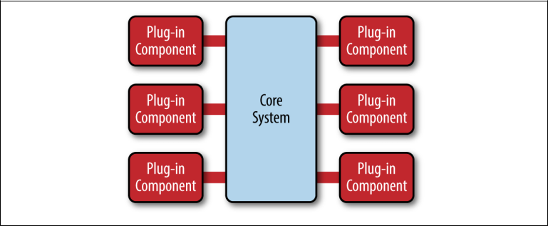
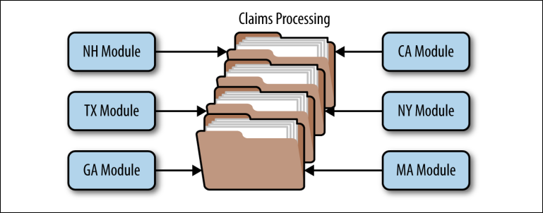

### CHAPTER 3
# 마이크로커널 아키텍처
마이크로커널 아키텍처 패턴(플러그인 아키텍처 패턴이라고도 함)은 제품 기반 애플리케이션을 구현하기 위한 자연스러운 패턴이다. 제품 기반 애플리케이션은 일반적인 타사 제품 버전으로 패키지되어 다운로드 할 수 있는 애플리케이션이다. 그러나 많은 기업들은 버전, 릴리스 노트, 플러그형 기능을 갖춘 소프트웨어 제품과 같은 내부 비즈니스 애플리케이션을 개발하고 출시한다. 이것들은 또한 이 패턴에 적합하다. 마이크로커널 아키텍처 패턴은 코어 애플리케이션에 플러그인으로 추가 애플리케이션 기능을 추가하여, 기능 분리 및 격리뿐만 아니라 확장성을 제공한다.

## 패턴 설명
마이크로커널 아키텍처 패턴은 코어 시스템과 플러그인 모듈이라는 두 가지 유형의 아키텍처 요소로 구성된다. 애플리케이션 로직은 독립형 플러그인 모듈과 기본 코어 시스템으로 구분되어, 애플리케이션 기능 및 사용자 정의 프로세싱 로직의 확장성, 유연성 및 격리를 제공한다. 그림 3-1은 기본 마이크로 커널 아키텍처 패턴을 보여줍니다.

마이크로 커널 아키텍처 패턴의 핵심 시스템에는 전통적으로 시스템 작동에 필요한 최소한의 기능 만 포함되어 있다. 많은 운영 체제는 마이크로 커널 아키텍처 패턴을 구현하며, 따라서 이 패턴 이름의 유래가 된다. 비즈니스-애플리케이션의 관점에서, 코어 시스템은 특별한 경우, 특별한 규칙 또는 복잡한 조건 처리를 위한 커스터마이즈 코드가 없는 일반적인 비즈니스 로직으로 정의된다.

_그림 3-1. 마이크로커널 아키텍처 패턴_

플러그인 모듈은 전문 처리, 추가 기능 및 사용자 정의 코드를 포함하는 독립적인 구성 요소로, 핵심 시스템을 강화하거나 확장하여 추가적 비즈니스 기능을 생성한다. 일반적으로 플러그인 모듈은 다른 플러그인 모듈과 독립적이어야 하지만 다른 플러그인이 필요한 플러그인을 설계할 수 있다. 어느 쪽이든, 종속성 문제를 피하기 위해 플러그인 간의 통신을 최소한으로 유지하는 것이 중요하다.

핵심 시스템은 플러그 인 모듈과 이를 이용하는 방법을 알아야 한다. 이것을 구현하는 한 가지 일반적인 방법은 일종의 플러그인 레지스트리를 사용하는 것이다. 이 레지스트리에는 각 플러그인 모듈에 대한 정보(플러그인이 코어 시스템에 연결되는 방법에 따라 다름)를 포함하여 이름, 데이터 계약 및 원격 액세스 프로토콜 세부 정보 등이 포함되어 있다. 예를 들어 고위험 세무 감사 항목에 플래그를 지정하는 세금 소프트웨어용 플러그인은 서비스의 이름(AuditChecker), 데이터 계약(입력 데이터 및 출력 데이터) 및 계약 형식(XML)을 포함하는 레지스트리 항목이 있을 수 있다. 플러그인이 SOAP를 통해 액세스되는 경우 WSDL (Web Services Definition Language)도 포함 할 수 있다.

플러그인 모듈은  OSGi(Open Service Gateway Initiative), 메시징, 웹 서비스 또는 직접 포인트 투 포인트 바인딩(예: 객체 인스턴스화) 등 다양한 방법으로 코어 시스템에 연결할 수 있다. 사용하는 연결 유형은 구축 중인 애플리케이션 유형(소규모 제품 또는 대규모 비즈니스 애플리케이션)과 특정 요구 사항(예: 단일 배포 또는 분산 배포)에 따라 달라진다. 아키텍처 패턴 자체는 이러한 구현 세부사항 중 어떤 것도 명시하지 않고 플러그인 모듈이 서로 독립적으로 유지되어야만 한다.

플러그인 모듈과 코어 시스템 사이의 계약은 표준 계약에서 사용자 정의 계약에 이르기까지 다양하다. 사용자 지정 계약은 일반적으로 플러그인이 사용하는 계약을 제어할 수 없는 제3자에 의해 플러그인 구성요소가 개발되는 상황에서 발견된다. 이러한 경우 코어 시스템에 각 플러그인에 대한 특수 코드가 필요하지 않도록 플러그인 접점과 표준 계약 사이에 어댑터를 생성하는 것이 일반적이다. 표준 계약(일반적으로 XML 또는 Java Map을 통해 구현)을 작성할 때, 처음부터 버전 과리 전략을 만들어야한다.

## 패턴 예제
마이크로커널 아키텍처의 가장 좋은 예는 Eclipse IDE일 것이다. 기본적인 Eclipse 제품을 다운로드하는 것은 당신에게 화려한 편집기 이상을 제공하지 않는다. 그러나 플러그인을 추가하면 사용자 정의가 가능하고 유용한 제품이 된다. 인터넷 브라우저는 마이크로커널 아키텍처를 사용하는 또 다른 일반적인 제품 사례로, 뷰어와 다른 플러그인은 기본 브라우저(즉, 코어 시스템)에 없는 추가 기능을 추가한다.

제품 기반 소프트웨어에 대한 예는 끝이 없지만, 대기업 애플리케이션은 어떤가? 마이크로커널 아키텍처는 이러한 상황에도 적용된다. 이 점을 설명하기 위해 다른 보험회사의 예를 사용하지만 이번에는 보험 청구 처리와 관련된 예를 들어보자.

클레임 처리는 매우 복잡한 과정이다. 주마다 보험 청구에서 허용되는 것과 허용되지 않는 것에 대해 다른 규칙과 규정이 있다. 예를 들어, 일부 주에서는 앞 유리창이 바위에 의해 손상되는 경우 무료로 앞 유리 교체를 허용하지만 다른 주에서는 그렇지 않습니다. 이는 표준 클레임 프로세스에 대해 거의 무한한 조건 세트를 만든다.

대부분의 보험 청구 애플리케이션은 이러한 복잡성을 처리하기 위해 크고 복잡한 규칙 엔진을 활용한다. 그러나 이러한 규칙 엔진은 하나의 규칙을 변경하면 다른 규칙에 영향을 미치거나 간단한 규칙을 변경하려면 분석가, 개발자 및 테스터가 필요하다. 마이크로커널 아키텍처 패턴을 사용하면 이러한 많은 문제를 해결할 수 있다.

그림 3-2에 보이는 폴더 스택은 클레임 처리를 위한 핵심 시스템을 나타낸다. 여기에는 사용자 지정 처리가없는 경우를 제외하고 보험 회사가 청구를 처리하는 데 필요한 기본 비즈니스 논리가 포함되어 있습니다. 각 플러그인 모듈에는 해당 상태에 대한 특정 규칙이 포함되어 있다. 이 예에서 사용자 정의 소스 코드 또는 별도의 규칙 엔진 인스턴스를 사용하여 플러그인 모듈을 구현할 수 있다. 구현에 관계없이, 핵심 요점은 상태 별 규칙 및 처리가 핵심 클레임 시스템과 별개이며 나머지 핵심 시스템 또는 기타 플러그인 모듈에 거의 영향을주지 않고 추가, 제거 및 변경 될 수 있다는 것이다.

_그림 3-2. 마이크로커널 아키텍처 예제_

## 고려 사항
마이크로커널 아키텍처 패턴의 한 가지 큰 점은 그것이 다른 아키텍처 패턴의 일부로 포함되거나 사용될 수 있다는 것이다. 예를 들어, 이 패턴이 애플리케이션의 특정 휘발성 영역에 대한 특정 문제를 해결한다면, 이 패턴을 사용하여 전체 아키텍처를 구현할 수 없다는 것을 발견할 수 있다. 이 경우 사용 중인 다른 패턴(예: 계층화된 아키텍처)에 마이크로서비스 아키텍처 패턴을 포함할 수 있다. 마찬가지로, 사건 중심 구조에 관한 이전 절에서 설명한 사건-프로세서 구성요소는 마이크로서비스 아키텍처 패턴을 사용하여 구현할 수 있다.

마이크로서비스 아키텍처 패턴은 진화 설계와 점진적 개발에 큰 지원을 제공한다. 먼저 고체 코어 시스템을 생산할 수 있으며, 애플리케이션이 점진적으로 발전함에 따라 코어 시스템을 크게 변경할 필요 없이 기능과 기능을 추가할 수 있다.

제품 기반 애플리케이션의 경우 마이크로커널 아키텍처 팻테른은 항상 시작 아키텍처로서 첫 번째 선택이어야 하며, 특히 시간이 지남에 따라 추가 기능을 출시하고 사용자가 어떤 기능을 사용할지 제어하고자 하는 제품의 경우 더욱 그러하다. 시간이 지남에 따라 패턴이 당신의 모든 요구사항을 충족시키지 못한다는 것을 알게 된다면, 당신은 항상 당신의 애플리케이션을 당신의 특정 요구사항에 더 잘 맞는 다른 아키텍처 패턴으로 리팩터링할 수 있다.

## 패턴 분석
다음 표에는 마이크로커널 아키텍처 패턴에 대한 공통 아키텍처 특성의 등급 및 분석이 수록되어 있다. 각 특징에 대한 등급은 패턴의 전형적인 구현에 기초한 능력으로서의 그 특성의 자연적 경향과 더불어 패턴이 일반적으로 알려진 것에 기초한다. 이 패턴이 이 보고서의 다른 패턴과 어떻게 관련되는지 나란히 비교하려면 이 보고서 끝에 있는 부록 A를 참조하십시오.

___전체적인 민첩성___

등급: 높음

분석: 전체적인 민첩성은 끊임없이 변화하는 환경에 신속하게 대응할 수 있는 능력이다. 변경사항은 느슨하게 결합된 플러그인 모듈을 통해 크게 분리되고 신속하게 구현될 수 있다. 일반적으로 대부분의 마이크로커널 아치 텍스쳐의 핵심 시스템은 빠르게 안정되는 경향이 있으며, 따라서 상당히 견고하며 시간이 지남에 따라 거의 변화가 필요하지 않다.

___배치 용이성___

등급: 높음

분석: 이런 패턴을 어떻게 구현되는 가에 따라서, 플러그 인 모듈 동적으로 런타임(예:hot-deployed)의 핵심적 시스템에, 배포 중에 작동하지 않는 시간을 최소화하면서 추가될 수 있다.

___시험성___

등급: 높음

분석: 플러그인 모듈은 분리하여 테스트할 수 있으며 코어 시스템에 의해 쉽게 조롱당하여 코어 시스템에 대한 변경 사항이 거의 없거나 전혀 없는 특정 기능을 시연하거나 프로토타입화할 수 있다.

___성능___

등급: 높음

분석: 마이크로커널 패턴은 자연스럽게 고성능 애플리케이션에 적합하지는 않지만, 일반적으로 마이크로커널 아키텍처 패턴을 사용하여 구축된 대부분의 애플리케이션은 필요한 기능만 포함하도록 애플리케이션을 사용자 지정하고 능률화할 수 있기 때문에 성능이 좋다. JBoss Application Server는 플러그 인 아키텍처를 통해 애플리케이션 서버를 필요한 기능만으로 자르고, 메모리, CPU 및 스레드를 소비하는 원격 액세스, 메시징 및 캐싱과 같은 값비싼 비사용 기능을 제거하고, 애플리케이션 서버를 느리게 할 수 있는 좋은 예다.

___확장성___

등급: 낮음

분석: 대부분의 마이크로커널 아키텍처 구현은 제품 기반이며 일반적으로 크기가 작기 때문에 단일 단위로 구현되므로 확장성이 높지 않다. 플러그인 모듈을 구현하는 방법에 따라 플러그인 기능 수준에서 확장성을 제공할 수 있는 경우도 있지만 전반적으로 이 패턴은 확장성이 높은 애플리케이션을 생성하는 것으로 알려져 있지 않다.

___개발 용이성___

등급: 낮음

분석: 마이크로커널 아키텍처는 신중한 설계와 계약 거버넌스를 필요로 하므로 구현이 다소 복잡하다. 계약 버전, 내부 플러그인 등록부, 플러그인 세분성 및 플러그인 연결에 사용할 수 있는 광범위한 선택은 모두 이러한 패턴 구현과 관련된 복잡성에 기여한다.
